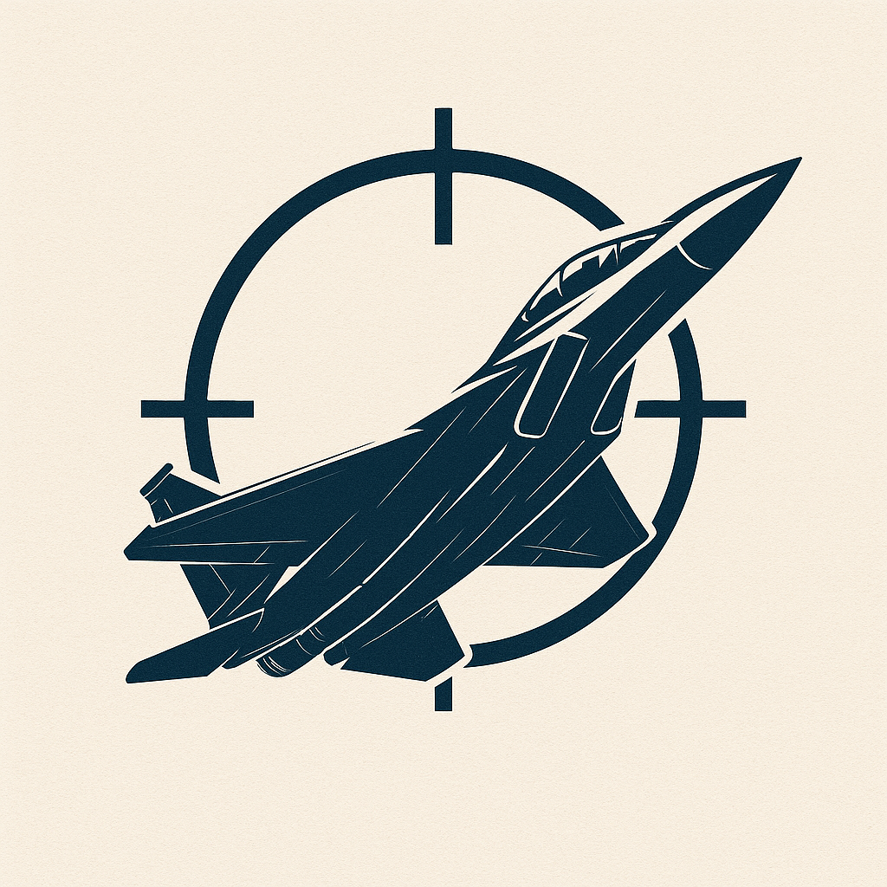

<p align="center">
  
</p>

# Air Combat Gym

A lightweight **3-DoF aircraft model** and **Gymnasium** environments for training reinforcement-learning agents on air-combat tasks especially for **dogfight** scenarios.

## Install

Prerequisites: Python 3.10+

```bash
pip install -e .
```

Optional extras:

```bash
pip install -e ".[render]"   # 3D pygame rendering
pip install -e ".[sb3]"      # Stable-Baselines3
```

## Quick Start

```python
from air_combat_gym import Dogfight1v1Env
from air_combat_gym.envs.base import EnvConfig

env = Dogfight1v1Env(EnvConfig(step_limit=500), render_mode="human")
obs, info = env.reset(seed=0)

for _ in range(100):
    action = env.action_space.sample()
    obs, reward, terminated, truncated, info = env.step(action)
    if terminated or truncated:
        obs, info = env.reset()

env.close()
```

---

## Aircraft Model

The 3-DoF point-mass model uses standard load-factor equations of motion:

| State | Symbol | Description |
|-------|--------|-------------|
| `x, y` | x, y | Horizontal position (m) |
| `h` | h | Altitude (m) |
| `v` | V | True airspeed (m/s) |
| `psi` | ψ | Heading angle (rad) |
| `gamma` | γ | Flight-path angle (rad) |

Control inputs: `nx` (tangential load factor), `nz` (normal load factor), `mu` (bank angle).

---

## Environments

All single-agent environments follow the standard **Gymnasium** API and share a common action space.

### Common Action Space

| Index | Name | Normalized Range | Scaled Range | Description |
|-------|------|-----------------|--------------|-------------|
| 0 | `nx` | [-1, 1] | [-1.0, 1.5] | Tangential load factor (thrust) |
| 1 | `nz` | [-1, 1] | [-3.0, 9.0] | Normal load factor (lift) |
| 2 | `mu` | [-1, 1] | [-75°, 75°] | Bank angle |

---

### `Dogfight1v1Env`

1v1 dogfight — ownship controlled, adversary flies straight.

| | Details |
|---|---------|
| **Observation** | 9-D: `[rel_x, rel_y, rel_h, own_v, own_psi, own_gamma, adv_v, adv_psi, adv_gamma]` (normalized) |
| **Action** | 3-D: `[nx, nz, mu]` in [-1, 1] |
| **Reward** | +100 if adversary in own WEZ, −20 if in adversary's WEZ, distance shaping `1 − d/d_max`, −5 if out of bounds (terminates), speed penalty below 100 m/s |
| **Termination** | Distance exceeds `distance_limit` (default 3000 m) |
| **Truncation** | Steps exceed `step_limit` (default 500) |

```python
from air_combat_gym import Dogfight1v1Env
env = Dogfight1v1Env()
```

---

### `Dogfight1vNEnv`

1vN dogfight — ownship controlled, N straight-line adversaries with fixed-size padded observation.

| | Details |
|---|---------|
| **Observation** | `(3*max_enemies + 3 + 3*max_enemies)`-D: relative positions to each enemy (padded with zeros), own kinematics, enemy kinematics |
| **Action** | 3-D: `[nx, nz, mu]` in [-1, 1] |
| **Reward** | +100 if any enemy in WEZ, −20 if any enemy has ownship in WEZ, distance shaping to closest enemy, −5 if closest enemy out of bounds |
| **Config** | `n_enemies` (default 1), `max_enemies` (default 4, determines obs size) |

```python
from air_combat_gym import Dogfight1vNEnv
from air_combat_gym.envs.base import EnvConfig
env = Dogfight1vNEnv(EnvConfig(n_enemies=3, max_enemies=4))
```

---

### `CircularTargetFollowEnv`

Follow a maneuvering target executing a coordinated constant-bank turn (~75° bank).

| | Details |
|---|---------|
| **Observation** | 9-D (same layout as Dogfight1v1Env) |
| **Action** | 3-D: `[nx, nz, mu]` in [-1, 1] |
| **Reward** | +250 if target in WEZ, −20 if in target's WEZ, distance shaping, speed penalty |

```python
from air_combat_gym import CircularTargetFollowEnv
env = CircularTargetFollowEnv()
```

---

### `RandomAdversaryDogfightEnv`

1v1 dogfight where the adversary takes random actions each step.

| | Details |
|---|---------|
| **Observation** | 9-D (same layout as Dogfight1v1Env) |
| **Action** | 3-D: `[nx, nz, mu]` in [-1, 1] |
| **Reward** | Same structure as Dogfight1v1Env (+100 WEZ, −20 threatened, distance shaping, speed penalty) |

```python
from air_combat_gym import RandomAdversaryDogfightEnv
env = RandomAdversaryDogfightEnv()
```

---

### `PretrainedOpponentEnv`

1v1 dogfight against a **pretrained SAC agent** (`opponent_sac`).

| | Details |
|---|---------|
| **Observation** | 9-D (same layout as Dogfight1v1Env) |
| **Action** | 3-D: `[nx, nz, mu]` in [-1, 1] |
| **Reward** | Same as Dogfight1v1Env |
| **Opponent** | Frozen SAC policy loaded from `air_combat_gym/pretrained/opponent_sac.zip` |

```python
from air_combat_gym import PretrainedOpponentEnv

env = PretrainedOpponentEnv()   # default bundled model
# env = PretrainedOpponentEnv(model_path="path/to/your/model")  # custom model
```

Requires `stable-baselines3`:
```bash
pip install -e ".[sb3]"
```

---

### `SelfPlayDogfightEnv`

**Multi-agent** — two independent agents each control one aircraft for self-play training.

| | Details |
|---|---------|
| **Observation** | Dict: `{"agent_0": 9-D, "agent_1": 9-D}` — each from their own aircraft's perspective |
| **Action** | Dict: `{"agent_0": 3-D, "agent_1": 3-D}` or flat 6-D array |
| **Reward** | **Zero-sum**: `agent_1 = −agent_0`. +100 WEZ hit, −100 WEZ threatened, distance shaping |
| **Termination** | Distance exceeds `distance_limit` |

```python
from air_combat_gym import SelfPlayDogfightEnv

env = SelfPlayDogfightEnv()
obs, _ = env.reset()

obs, rewards, dones, truncs, infos = env.step({
    "agent_0": env._single_action_space.sample(),
    "agent_1": env._single_action_space.sample(),
})
# rewards["agent_0"] == -rewards["agent_1"]
```

---

## Creating a Custom Environment

All single-agent environments inherit from `BaseAirCombatEnv`. To create your own:

```python
from air_combat_gym.envs.base import BaseAirCombatEnv, EnvConfig
from air_combat_gym.models import Aircraft
import numpy as np


class MyCustomEnv(BaseAirCombatEnv):
    """Example: ownship vs an adversary that climbs."""

    def __init__(self, config=None, render_mode=None):
        super().__init__(config=config, render_mode=render_mode)

    def _reset_aircraft(self):
        # Called by reset() — initialize both aircraft
        self.aircraft1 = Aircraft(0, 0, 1000, 250, 0, 0)        # ownship
        self.aircraft2 = Aircraft(0, 1000, 1000, 250, np.pi, 0)  # adversary

    def _apply_dynamics(self, nx1, nz1, mu1):
        # Called by step() — update aircraft states
        self.aircraft1.update(nx1, nz1, mu1)       # ownship: user-controlled
        self.aircraft2.update(0.0, 1.2, 0.3)       # adversary: fixed climbing turn

    def _calculate_reward(self):
        # Return (reward: float, terminated: bool)
        terminated = False
        reward = 0.0

        # +100 for getting adversary in WEZ
        if self.aircraft1.wez(self.aircraft2.x, self.aircraft2.y, self.aircraft2.h):
            reward += 100.0

        # Distance shaping
        dx = self.aircraft1.x - self.aircraft2.x
        dy = self.aircraft1.y - self.aircraft2.y
        dh = self.aircraft1.h - self.aircraft2.h
        distance = float(np.sqrt(dx**2 + dy**2 + dh**2))
        reward += 1.0 - distance / self.config.distance_limit

        if distance > self.config.distance_limit:
            terminated = True

        # You can write your own reward function here instead of the default one above

        return reward, terminated
```

You only need to implement three methods:

| Method | Purpose |
|--------|---------|
| `_reset_aircraft()` | Create `self.aircraft1` (ownship) and `self.aircraft2` (adversary) |
| `_apply_dynamics(nx, nz, mu)` | Update both aircraft — ownship with the given controls, adversary with your logic |
| `_calculate_reward()` | Return `(reward, terminated)` |

Everything else (Gymnasium API, action scaling, observation building, 3D rendering) is handled by the base class.

To register your environment so it works with `make_env()`:

```python
from air_combat_gym.envs.registry import ENV_REGISTRY
ENV_REGISTRY["my_custom"] = MyCustomEnv

# Then use:
from air_combat_gym import make_env
env = make_env("my_custom")
```

---

## 3D Rendering

Pass `render_mode="human"` to any environment to enable the interactive Pygame renderer:

```python
env = Dogfight1v1Env(render_mode="human")
```

| Control | Action |
|---------|--------|
| Left-drag | Rotate camera |
| Right-drag | Pan |
| Scroll | Zoom in/out |
| R | Reset camera |
| ESC | Quit |

Requires pygame:
```bash
pip install -e ".[render]"
```

---

## Examples

See the `examples/` directory:
- `eval_pretrained.py` — Evaluate a random agent against the pretrained SAC opponent with 3D rendering
